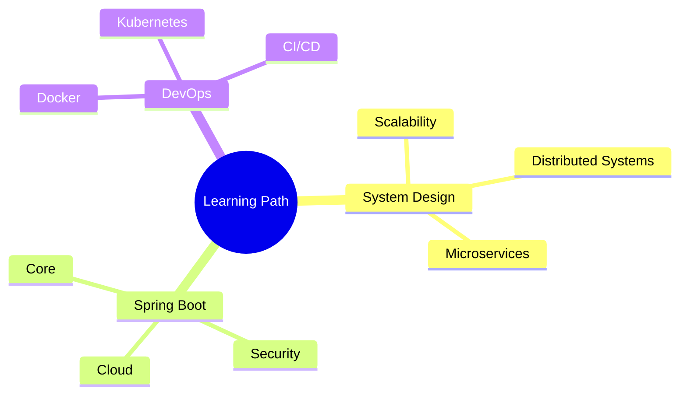

<div align="center">
  
# Hello World! I'm Vedant 👋

<p align="center">
  <a href="linkedin.com/in/vedant-tiwari-358773202/" target="_blank">
    
  </a>
  <a href="mailto:vedanttiwari641@gmail.com">
    
  </a>
</p>

### `$ whoami`
Software Developer | Tech Enthusiast | Problem Solver

</div>

## 👨‍💻 About Me

```typescript
const vedant = {
    pronouns: "he/him",
    location: "India",
    code: ["Go", "TypeScript", "Python", "Java"],
    currentFocus: "Building scalable distributed systems",
    currentLearning: ["System Design", "Spring Boot", "DevOps"],
    funFact: "I love turning coffee into code! ☕"
};
```

## 🛠️ Tech Stack

<div align="center">
  <h3>Languages & Frameworks</h3>
  <br/>
  
  
  <h3>Database & Tools</h3>
  <br/>
  
  
  <h3>Others</h3>
  
</div>

<!--
## 🚀 Featured Projects

<div align="center">
  <a href="[your-repo-link](https://github.com/vedant-colab/RecipeRama)">
    
  </a>
  <a href="[your-repo-link](https://github.com/vedant-colab/ShawrtyURL)">
    
  </a>
</div>
-->

### 💻 Real-Time Code Editor
A collaborative coding platform enabling multiple users to code together in real-time
- 🔄 Real-time synchronization using WebSocket
- 🎨 Clean, intuitive UI built with React & TypeScript
- 🐳 Containerized with Docker
- 🔒 Secure user authentication
- 📝 Multiple language support

### 🎯 NexusMeet
Modern video conferencing platform built with cutting-edge technologies
- ⚡ Backend powered by Go Fiber
- 🎨 Responsive React frontend
- 🗄️ PostgreSQL for data persistence
- 📡 Real-time communication
- 🔄 WebRTC integration

## 📊 GitHub Stats

<div align="center">
  
  
</div>

## 📚 Current Learning Focus



## 🎯 Goals for 2024

- 🌟 Master distributed systems design
- 📚 Contribute more to open source
- 💡 Build scalable microservices
- 📖 Write technical blogs
- 🚀 Launch personal projects

## 🤝 Let's Connect!

<div align="center">
  
Feel free to connect with me for collaboration, discussion, or just a friendly chat about tech!

[](linkedin.com/in/vedant-tiwari-358773202/)

</div>

---
<div align="center">
  
</div>
