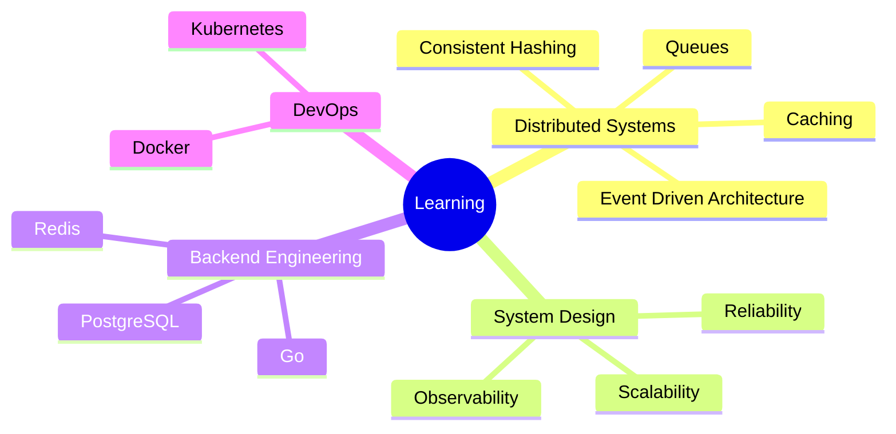

<div align="center">

# Hey 👋 I'm Vedant

### Backend Developer • Open Source Enthusiast • Builder

<p>
  <a href="https://www.linkedin.com/in/vedant-tiwari-358773202">
    
  </a>
  <a href="mailto:vedanttiwari641@gmail.com">
    
  </a>
</p>


</div>

---

## 👨‍💻 About Me

```go
var Vedant = struct {
    Location      string
    Languages     []string
    CurrentFocus  []string
    FunFact       string
}{
    Location: "India",

    Languages: []string{
        "Go",
        "TypeScript",
        "JavaScript",
    },

    CurrentFocus: []string{
        "System Design",
        "Distributed Systems",
        "Backend Engineering",
        "Open Source",
    },

    FunFact: "I enjoy building things from scratch.",
}
```

---

## ⚒️ Tech Toolbox

<div align="center">

### Languages


### Backend & Frameworks


### Databases


### Infrastructure


### Tools


</div>

---

## 📊 GitHub Analytics

<div align="center">


</div>

<div align="center">


</div>

---

## 🚀 Projects I Had Fun Building

### 💻 Real-Time Collaborative Code Editor

* Multi-user collaborative coding
* Real-time synchronization using WebSockets
* React + TypeScript frontend
* Dockerized deployment
* Multiple language support

---

### 🔗 ShawrtyURL

* URL shortening service built in Go
* Redis caching
* PostgreSQL persistence
* RESTful API design

---

### ⚡ Distributed Rate Limiter

* Go Fiber
* Redis
* Nginx
* Docker Compose

Built to explore distributed systems concepts and traffic throttling strategies.

---

## 🌱 Currently Exploring


```mermaid
mindmap
  root((Learning))
    Distributed Systems
      Consistent Hashing
      Caching
      Queues
      Event Driven Architecture

    System Design
      Scalability
      Reliability
      Observability

    Backend Engineering
      Go
      PostgreSQL
      Redis

    DevOps
      Docker
      Kubernetes
```

---

## 🎯 2026 Goals

* Build more production-grade side projects
* Contribute to open source regularly
* Deep dive into distributed systems
* Write technical blogs
* Learn something new every month

---

## ☕ Random Dev Wisdom

```text
First make it work.
Then make it clean.
Then make it fast.
```

---

<div align="center">

### Thanks for stopping by 👋


</div>
